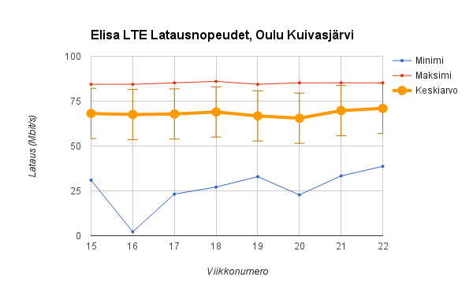
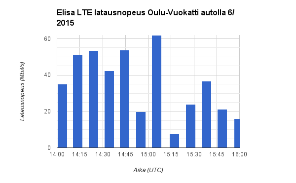
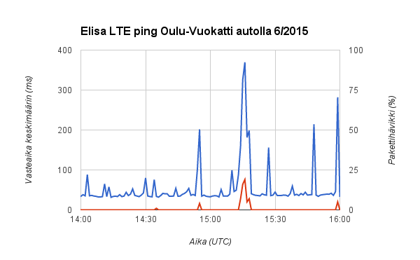
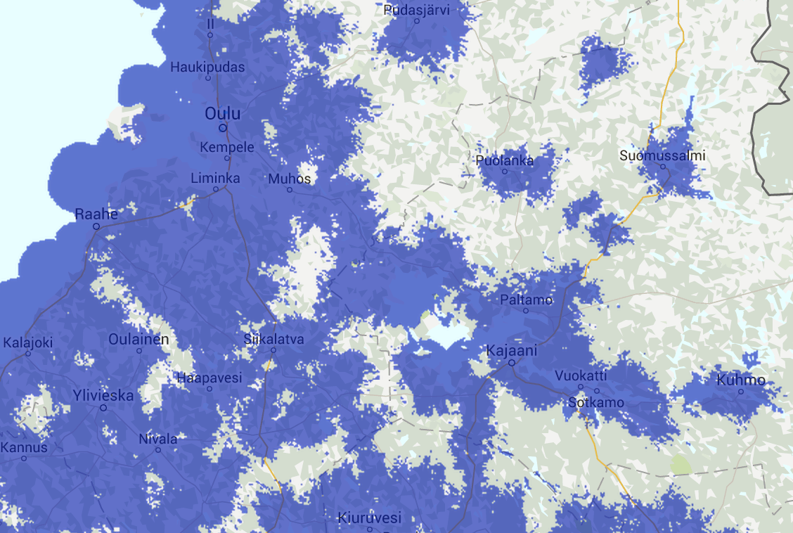

Kävin lauantaina puhumassa LTE-kokemuksistani [Itäsuomalaisten
radioharrastajien kesäpäivillä][garde] Vuokatissa, Sotkamossa.
Aiheenani oli *“LTE käytännössä - vieläkö kiinteää yhteyttä tarvitaan?”*
Otsikosta voi päätellä yleiskuvan tähänastisista kokemuksistani.

<!--more-->

## LTE kiinteän yhteyden korvaajana kotona

Muutettuani takaisin Suomeen Yhdysvalloista en hankkinut
kiinteää laajakaistaa vaan olen käyttänyt Elisan LTE-yhteyttä
ainoana kotiyhteytenä. Voin nyt puhua LTE:stä miltei vuoden
kokemuksella kiinteän laajakaistan korvikkeena.

Kotiosoitteeseeni sai ainoastaan 24M ADSL-yhteyttä kun muutin
takaisin. ADSL:ssä paluukaistan nopeus on vain 1 Mbit/s, mikä
ei riitä minulle sillä muun muassa varmuuskopioin tiedostoni
Internetin kautta. Tutkin vaihtoehtoja ja päädyin siihen tulokseen
että minun kannattaa ainakin kokeilla LTE-liittymää. Jos se ei
olisi toiminut riittävän hyvin, olisin voinut kuitenkin ottaa
kiinteän yhteyden rinnalle ja käyttää LTE-liittymää matkakäytössä.

Liittymä                  | Nopeus         | Hinta, 24kk määräaikainen         |
--------------------------|----------------|-----------------------------------
Saunalahti 4G Super       | 100 Mbit/s LTE | **19,90 €/kk** (norm. 29,80 €/kk) |
DNA Tuplakaista 40 (DSL)  | 40 Mbit/s VDSL2| **54,90 €/kk** (norm. 74,80 €/kk) |

Liittymien hintaero tuntuu käsittämättömältä, sillä käyttäjän
kannalta erona on että LTE vaikuttaa olevan sekä halvempi että
nopeampi kuin kiinteä yhteys, minkä lisäksi sitä ei ole sidottu
paikkaan.

Esitystäni varten mittasin kotiyhteyteni toimintaa. Seuraavat mittaukset
on tehty kotonani Oulun Kuivasjärvellä välillä 15.4.2015 – 5.6.2015.
Latausnopeus on kunkin viikon keskiarvo; 100 MB tiedosto on ladattu
kerran tunnissa ja nopeus kirjattu, siis 24x7 = 168 latausta (16,8 GB)
per piste.

Kuten kuvaajasta hyvin näkee, keskimääräinen latausnopeus
ei juuri vaihtele. Keskiarvo jää huipusta uskoakseni pääasiassa siksi
että jos yhteydessä ei ole kulkenut liikennettä hetkeen, nopeus kiihtyy
pikkuhiljaa eli huippunopeutta ei saavuteta kuin myöhemmin latauksessa.
Nopeudet ovat erittäin vakaita.
Minimiä ei kannata tuijottaa, koska yksittäinen näyte sotkee niin
paljon. Kuvaajan minimi on nimittäin huonoin viikon 168 latauksesta.

Vasteaika on mitattu fpingillä 1 paketti kerran 10 sekunnissa samalla
aikavälillä.

| &nbsp;     | Latausnopeus           | Vasteaika       |
| ---------: | :--------------------- | :-------------- |
| Keskiarvo  | 68 Mbit/s ± 14 Mbit/s  | 46 ms ± 25 ms   |
| Maksimi    | 86 Mbit/s              | 8150 ms         |
| Minimi     | 2 Mbit/s               | 27 ms           |
||

### Mitä huonoa mobiililaajakaistassa?

IPv4-osoitteiden loppuminen ilmenee ensimmäisenä niin että operaattorit
eivät jaa julkisia reitittyviä IP-osoitteita mobiililaajakaistoihin
tai kännyköihin. Käytännössä tästä seuraa että suorat peer-to-peer-yhteydet
eivät onnistu. Miten asia ilmenee riippuu kustakin sovelluksesta.

Peleissä nykyään useimmat pelit järjestävät palvelimet eikä niitä enää
tarvitse pyörittää kotiyhteydellä. Useimmille mahdolliset ongelmat
ilmenevät esim. Skype-puhelun huonossa kuvanlaadussa sillä Skype
osaa välittää liikenteen kyllä vaikka molemmat käyttävät käyttävät
osoitteenmuunnosta (NAT), mutta tällöin yhteyden nopeus on todella rajattu.
Omien kokemusten kanssa joskus, ei aina, ei kaikkien kanssa, erityisesti
näytön jakaminen tai videopuhelu saattavat tökkiä. Ongelmalliseksi
tavalliselle käyttäjälle asian tekee sen vaikea ennustettavuus - uskoisin
että tavallinen käyttäjä syyttäisi asiasta Skypeä.

Tavallisen kuluttajan kannalta osoitteiden loppuminen ei luultavasti
näy muuten kuin ym. erikoisina ongelmina. Ongelmalla ei ole sikäli tekemistä
verkkotekniikan kanssa vaan ongelma koskee koko Internetiä. Ratkaisu
ongelmaan on IPv6, mutta se vaatii operaattorien lisäksi tukea myös
kaikilta sovelluksilta ja muilta verkon käyttäjiltä, esim. niiltä joille
Skypellä soitan.

LTE ei pysty korvaamaan valokuitua kapasiteetissa. Vaikka ruuhkattomassa
solussa nopeudet voivatkin olla samaa luokkaa kuin nopeimmissa kiinteissä
liittymissä, tosiasia on että LTE:n maksiminopeus on 150 Mbit/s per sektori
per kanava ja se ei pysty mitenkään riittämään esim. siihen että kaikki
siirtyisivät katsomaan televisiota mobiililaajakaistan kautta yhtäaikaa.

Kuuluvuus on erittäin paikkariippuvaista. Elisan LTE-verkko on erittäin
kattava, mutta puutteita on vielä. Ehkä merkittävämpänä ongelmana verkko
on alueellisesti ruuhkautunut. Ongelmaa voi helpottaa kun kahden
kantoaallon LTE (4G+, LTE-A) etenee ja lisää kapasiteettia. Ylipäätään
mitä enemmän tukiasemia on, sitä enemmän verkossa on kapasiteettia.

## LTE automatkalla Oulusta Vuokattiin

<iframe src="https://www.google.com/maps/embed?pb=!1m24!1m8!1m3!1d3509839.2651142473!2d26.868107!3d64.561595!3m2!1i1024!2i768!4f13.1!4m13!3e0!4m5!1s0x468032a8c02185c1%3A0x8bb02d322b12e97d!2sOulu%2C+Finland!3m2!1d65.0126148!2d25.4714526!4m5!1s0x4682f16866c1ee3f%3A0xa0146d8a395b970!2sVuokatti%2C+Finland!3m2!1d64.1457767!2d28.268998999999997!5e0!3m2!1sen!2sfi!4v1433673500711" width="400" height="300" frameborder="0" style="border:0"></iframe>

Matkalla Oulusta Vuokattiin mittasin yhteyden toimivuutta fpingillä
(ICMP echo) ja wgetillä. Koko matkan LTE-modeemini oli pakotettu 4G-tilaan.
Odotin, että yhteys katkeaa ainakin osan matkan aikana, mutta Spotify
soi ongelmitta ja pätkimättä koko matkan Oulusta perille.

Latausnopeudet ovat selvästi paremmat mitä olisin odottanut matkalle.
Ainoastaan 15:15(UTC) mittauksen nopeus on hidas, alle 10 Mbit/s, mutta
silti helposti musiikin ja ainakin SD-resoluution videon katsomiseen.
Muun osan matkasta nopeus riittäisi helposti HD-videostriimaukseen.
Aika hyvin! Siis nyt puhutaan kuitenkin liikkuvasta autosta 80–100 km/h
ja vielä rakenteilla olevasta LTE-verkosta.

Vasteaikamittauksen perusteella yhteys on lukuunottamatta muutamaa
heikompaa kohtaa erittäin käyttökelpoinen. Helposti riittävän hyvä
interaktiiviseen SSH-pääteyhteyteen, videopuheluun tai jopa
verkkopelaamiseenkin. Erityisesti huomionarvoista on, että ping-mittaus
tehtiin samalla yhteydellä, millä yllä olevat lataustestit ja silti
vasteaika pysyi erittäin kohtuullisena. Samaa ei todellakaan olisi
voinut tehdä 3G-verkossa.

Selvästi Itä-Suomen verkko on vielä keskeneräinen, mikä näkyy myös
kuuluvuusaluekartasta. Kuitenkin jo nyt kuuluvuus riittää liikkuvassa
autossa täysiveriseen verkon käyttöön. Luultavasti kännykällä kuuluvuus
ei vielä riittäisi yhtä hyvin. Minun testissäni käytin päätelaitteena
Huawein verkkovirtaista modeemia, jossa on hyvät sisäiset antennit,
varmasti paremmat kuin mitä kännyköissä sopii olemaan.

Odotukset on asetettu. Vähintään näin verkon pitää toimia.

## Päätelmiä

Käytännön kokemukseni on että yhteys kelpaa aivan hyvin jopa
verkkopelaamiseen, tosin ammattitasolla varmaan tarvittaisiin vielä
pienempiä ja vieläkin vähemmän vaihtelevia vasteaikoja.
3G-verkosta tutut viiveen vaihtelut eivät kuitenkaan ole tavallisia
ainakaan minun LTE-yhteydessäni. Edes
tiedostojen lataaminen ei haittaa interaktiivista käyttöä kuten SSH.

LTE on mielestäni jo tänään pidemmällä mitä luullaan.
Yhteyden laatu on parhaimmillaan hyvän kiinteän yhteyden kanssa
samaa luokkaa niin nopeuksien kuin vasteajan puolestakin.
On totta, että alueellisesti ruuhkia on. Esimerkiksi Tampereen
Hervannassa käydessäni suurin latausnopeus minkä saavutin sisällä
oli 17 Mbit/s. Toisaalta esim. Vuokatissa hotellissa nopeudet olivat
yli 60 Mbit/s kun LTE-päätelaite oli ikkunalla, eli LTE toimi selvästi
paremmin kuin hotellin tarjoama WLAN-yhteys.

Luonnollisesti kapasiteetti on rajallinen ja tekniikka ei riitä siihen
että kaikille riittäisi koko ajan näitä nopeuksia. Ottaen huomioon
nopeuksien ja saatavuuden huima parantuminen viime vuosina, on kuitenkin
syytä odottaa että tulevaisuudessa voidaan odottaa tämän tasoisia yhteyksiä.
Vaatimukset ja odotukset tekniikalta tapaavat nousta.

Henkilökohtaisesti odotan, että tulevaisuudessa sekä broadcast TV että
radio siirtyvät IP-verkkoihin. Mobiiliverkot tuntuvat kehittyvän aivan
ylivertaista vauhtia verrattuna broadcast-tekniikoihin. Onko tekniikka
sitten LTE-A vai yhdistelmä sitä, valokuitua, WiFiä ja jotain muuta,
en tiedä.
Oma käyttöprofiilini on siirtynyt jo täysin
Video-on-Demand palveluihin ja musiikkini striimaan Spotifystä.
Käytän paljon kaistaa ja odotan että verkko kehittyy vaatimusteni mukana.

## Liite: Mittausjärjestely

Kaikki mittaukset on tehty niin että Huawei B593S-22 LTE-modeemi
(150 Mbit/s) on pakotettu 4G-tilaan. Modeemiin on kytketty Ethernetillä
Apple Airport Extreme, joka tekee osoitteenmuunnoksen ja jakaa yhteyden
WLANilla. Kotona tehdyt mittaukset on tehty Linux-palvelimella, joka on
1 Gbit/s yhteydellä suoraan kiinni Airport Extremessä. Matkamittaukset
on tehty Apple Macbook Pro:lla, joka on yhdistetty 802.11ac WLANin
kautta Airport Extremeen. Eli ihan sama kuin [Tampereen reissulla][tre]
aiemmin.

Latausnopeutta mitataan lataamalla 100 MB tiedosto HTTP:llä. Kotona
mittausväli on kerran tunnissa. Matkalla mittasin siten että jokaisen
latauksen valmistuttua pidettiin 10 minuuttia taukoa ennen seuraavaa
100 MB latausta.


#!/bin/bash
wget -O /dev/null ilkka.kapsi.fi/100MB >wget/$(date +%s) 2>&1


Viiveen ja pakettihukan mittaamiseen käytän fping-työkalua, joka
lähettää ICMP echo -paketteja. Kotona mittausväli on yksi paketti
kerran 10 sekunnissa. Matkalla halusin tutkia soveltuvuutta esim.
verkkopelaamiseen, joten mittasin koko matkan ajalta 10 pakettia
sekunnissa.


fping -l -D -p 100 hilla.kapsi.fi > fping-`date +%s`.log 2>&1


Molemmissa mittauksissa käytin siis Kapsin palvelimia, jotka sijaitsevat
Helsingissä hyvien yhteyksien päässä.

[garde]: https://garde.fi/oh8g.php?func=SHOW&id=46 "Itäsuomalaiset radioharrastajien kesäpäivät 5.-7.6.2015, Vuokatti"
[tre]:  "LTE-kokemuksia automatkalta Oulu–Tampere"
