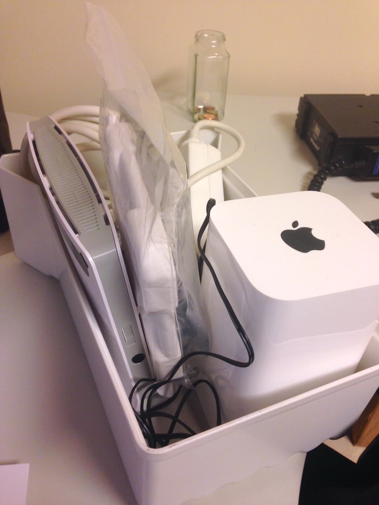
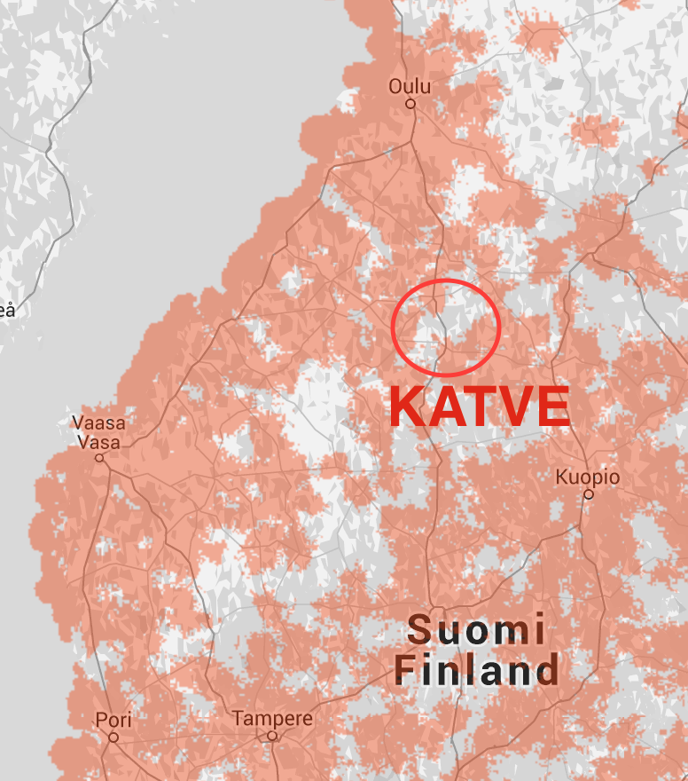
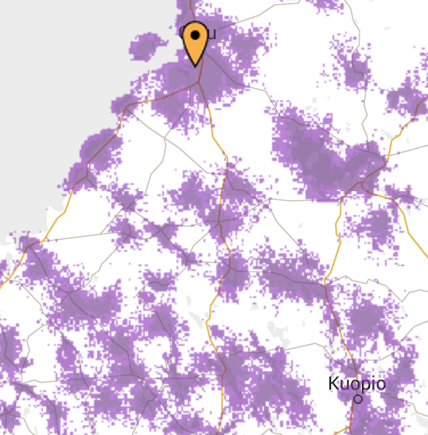
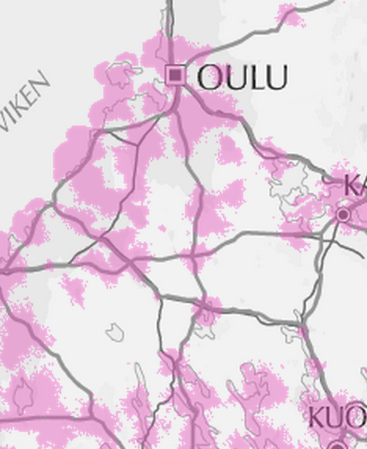

Kävin työmatkan vuoksi Tampereella. Helka halusi mukaan matkaan,
joten oli kätevintä tehdä reissu omalla autolla. Reitiksi valitsimme
Oulu–Jyväskylä–Tampere. Matkalla seurasin LTE-yhteyden toimivuutta.

<!--more-->

<iframe src="https://www.google.com/maps/embed?pb=!1m35!1m12!1m3!1d3685280.1602383927!2d20.11909369049114!3d63.19141266241929!2m3!1f0!2f0!3f0!3m2!1i1024!2i768!4f13.1!4m20!1i0!3e0!4m5!1s0x46802ce18bafffc1%3A0xa0146d8a395e450!2sKuivasj%C3%A4rvi%2C+Oulu!3m2!1d65.0698244!2d25.497168199999997!4m5!1s0x46857415d1a93119%3A0xba57697d6790a2d7!2zSnl2w6Rza3lsw6Q!3m2!1d62.244747!2d25.747218399999998!4m5!1s0x468edf554593da5d%3A0x6adfe3bd1e0b22c0!2sTampere!3m2!1d61.4981508!2d23.761025399999998!5e0!3m2!1sen!2sfi!4v1422809559795" width="600" height="450" frameborder="0" style="border:0"></iframe>

Olin pari viikkoa
aiemmin ostanut autokäyttöön
[imukuppikiinitteisen LTE-antennin][antenni], jotta kuuluvuus olisi
paras mahdollinen. Huawein B593s-22 LTE-modeemin WLAN-tukiasema
rajoittaa kotikokemusten perusteella yhteyden nopeutta. Joka tapauksessa
tarvitsin invertterin sen käyttämiseksi autossa, joten otin mukaan kotoa
myös Applen Airport Extreme 802.11ac -tukiaseman. Vähän tuli ehkä
liioiteltua hätävarjelua, mutta toimiipahan. Tiedän, koska käytän tällä
hetkellä ainoana yhteytenä kotona kyseistä kalustoa.

Päädyin aiemmin mainittuun antenniin mietittyäni ensin kiinteän
antennin asentamista autoon.
Totesin kuitenkin että asennus olisi tarpeettoman kallis enkä tahdo
uuteen autoon reikiä. Lisäksi teknologian kehittyessä erillinen antenni
on helppo vaihtaa uusille taajuusalueille, tai parhaimmillaan jää
tarpeettomaksi kun verkko kehittyy.

Olin odottanut, että LTE-verkko olisi melko kattava, mutta en uskonut
että koko matkan aikaa pystyisin käyttämään LTE-verkkoa. Tämän vuoksi
olin hieman skeptinen, että yhteys toimisi häiriöttä koko matkaa,
sillä aiempien kokemuksien vuoksi verkkojen välillä vaihtamisesta
aiheutuu katko tai pahimmillaan laite hukkaa verkon kokonaan. Asia
korostuu erityisesti liikkuvassa autossa.

Yllätyksekseni jouduin toteamaan, että ehkä noin 5 minuutin katkosta
lukuunottamatta yhteys toimi äärimmäisen hyvin. Vasteaika oli
keskimäärin n. 50-60 ms luokkaa. Subjektiivisesti yhteys vastasi
miltei koko matkan kiinteää yhteyttä. Puhuin jopa 20 minuutin
Skype-puhelun näytönjakamisella eikä yhteydessä ollut mitään
ongelmia. Numerodataa minulla ei ole tallessa, mutta 6000 paketin
ping-testin ajalta pakettihävikki oli alle 0,1% eli kiinteää
yhteyttä vastaavassa luokassa. SSH-yhteydessä en huomannut
havaittavaa viivettä.

Kotona selvisi, että Elisan verkossa on tosiaankin katvealue
Pyhäjärven ja Kärsämäen välillä. Tätä katkosta lukuunottamatta
auton sisäpuolella olevan lisäantennin avulla LTE-yhteys toimi
ongelmitta ja nopeasti koko muun matkan ajan. Elisalle vinkiksi,
että kannattaa tuo katve vielä korjata ja sen jälkeen voi alkaa
mainostamaan "nopein", "laajin" jne. superlatiivien lisäksi
että minkä kaupunkien välillä LTE-verkko toimii myös liikkuvalle
käyttäjälle.

Asuttuani 2 vuotta Yhdysvalloissa Piilaaksossa, auon joka kerta
suuta kun joku suomalainen operaattori möläyttää että Yhdysvalloista
pitäisi ottaa mallia 4G-verkkojen osalta. Oman kokemukseni pohjalta
siellä LTE-verkot toimivat parhaimmillaankin vain yhtä nopeasti
kuin hyvät 3G-verkot täällä, ja ylipäätään mikään kännykkäverkko
ei kuulunut kun ajoi taajama-alueen ulkopuolelle (erityisesti
laaksoa ympäröivään vuoristoon). Hinnoittelusta puhumattakaan;
oma liittymäni maksoi siellä n. $100/kk kytkypuhelimen kanssa.
Jos joku väittää että täällä pitäisi ottaa sieltä mallia missään
muodossa, huhhuh!

Mobiilit yhteydet, niin puhe- kuin datayhteydet, ovat yksi syistä
miksi asun mielelläni Suomessa! Suosittelen nettiä autossa
tarvitseville lämpimästi käyttämääni [Mobevon antennia][antenni].
Tukiasemaksi riittää yksinkertaisempikin ja todennäköisesti
kannattaa hankkia LTE-modeemi, jossa on sisäinen WLAN-tukiasema
ja joka ei tarvitse invertteriä. Toisaalta invertteristä saa
verkkovirtaa myös läppärin lataamiseen. Ainakin
Oulu–Tampere-reitille voin suositella Saunalahden 100 Mbit/s
LTE-liittymää. Nopeudet jäävät autossa 5-25 Mbit/s välille,
mutta sekin riittää hyvin liikkeellä.

---

**Päivitys 1.2.2015 20:49**. Kilpailevien operaattorien kuuluvuus vertailun vuoksi. Valitettavasti ainakaan vielä nettiyhteydeksi autoon ei ole muita vaihtoehtoja kuin Elisa/Saunalahti.

[antenni]: https://www.4g-antennit.fi/product/348/mobevo-w435-2-4-dbi-4glte-kaksoisantenni-2-metrin-kaapeleilla "Mobevo W435 4G/LTE kaksoisantenni, 4g-antennit.fi"
[kuuluvuus]: http://elisa.fi/kuuluvuus/ "Elisa/Saunalahti kuuluvuuskartta"
